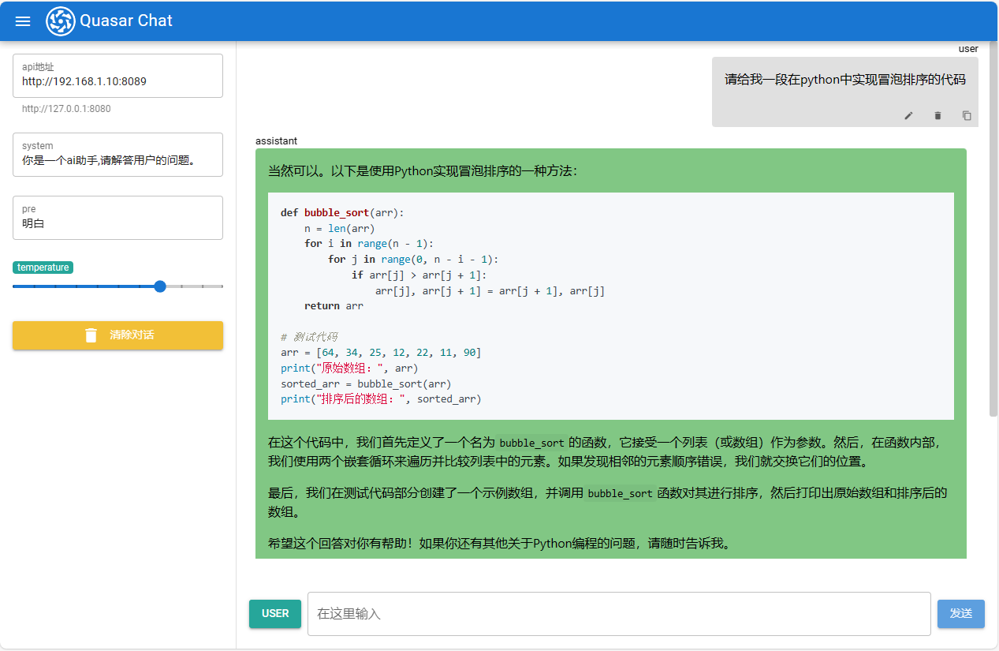

# 简易llm聊天webUI

用于方便的在其他设备访问本地部署的基于openai api的llm聊天服务,支持历史对话修改,markdown显示

## 运行
下载spa.zip并解压，使用任意http服务器打开index.html即可
例如
```bash
python -m http.server
```

## 注意事项
使用lm studio时，需要在lm studio中允许跨域访问


